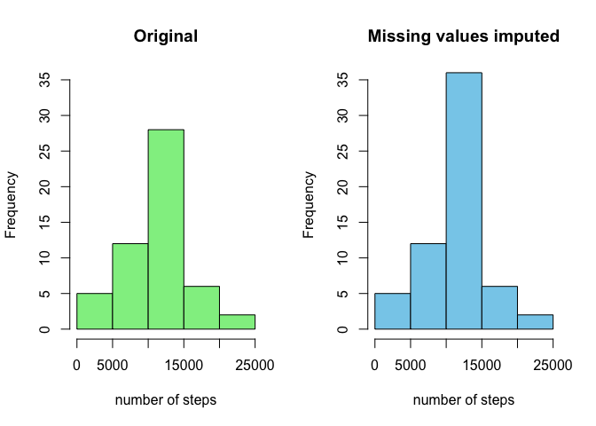
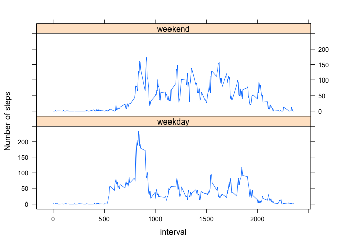

# Reproducible Research: Peer Assessment 1

## Loading and preprocessing the data

First things first, I'll use `read.csv` to add data to data frame `x`.


```r
x <- read.csv("activity.csv", colClasses = c("integer", "character", "integer"))
```

Next, the date will be converted to POSIXct format using the `strptime` command and stored in the column `newDate`.


```r
x$newDate <- as.POSIXct(strptime(x$date, '%Y-%m-%d'))
x$timeInterval_hour <- x$interval %/% 100
x$timeInterval_min <- x$interval %% 100
x$time <- sprintf("%0.2d:%0.2d", x$timeInterval_hour, x$timeInterval_min)
```

## What is mean total number of steps taken per day?
First, make a histogram of the total number of steps taken each day.  For this part of the assignment, missing values can be ignored.


```r
x_byDay <- aggregate(steps ~ date, data = x, FUN = sum)
hist(x_byDay$steps, main = "Histogram of number of steps taken each day", xlab = "number of steps", col = "lightgreen")
```

 

In this next part of the assignment, the mean and median total number of steps is calculated and reported.  


```r
meanSteps <- as.integer(round(mean(x_byDay$steps, na.rm = TRUE)))
medianSteps <- as.integer(round(median(x_byDay$steps, na.rm = TRUE)))
```

The mean number of steps taken per day is 10766 and the median number of steps taken is 10765.
    
## What is the average daily activity pattern?

A time series plot of the 5-minute interval (x-axis) and the average number of steps taken, averaged across all days (y-axis) is created.  For this part of the assignment, I'm using the `dplyr` package and creating a new data frame named `x2`.


```r
average_byInterval <- aggregate(steps ~ time, data = x, mean)
average_byInterval$timeInterval <- as.POSIXct(average_byInterval$time,
                                              format = "%H:%M")
plot(average_byInterval$timeInterval, average_byInterval$steps,
     type = "l",
     xlab = "Interval time",
     ylab = "Average number of steps")
```

 

```r
maxIntervalTime <- average_byInterval$timeInterval[which.max(average_byInterval$steps)]
maxInterval <- format(maxIntervalTime, format = "%H:%M")
```

The 08:35 interval has the highest average number of steps.

## Imputing missing values

In this part of the assignment, the total number of missing values in the dataset is calculated and reported.  The total number of missing values is easily calculated using the `is.na` command.


```r
sumNA <- sum(is.na(x))
```

There are 2304 missing values in the data set.

My strategy for filling in all of the missing values in the dataset is to assign all missing values the mean of all other days.  


```r
y <- merge(x, average_byInterval, by = "time")
y$steps.x[is.na(y$steps.x)] <- y$steps.y[is.na(y$steps.x)]
y <- data.frame(y$steps.x, y$date, y$interval, y$timeInterval, y$time)
colnames(y) <- c("steps", "date", "interval", "timeInterval", "time")

y_byDay <- aggregate(steps ~ date, data = y, FUN = sum)

meanSteps2 <- as.integer(round(mean(y_byDay$steps, na.rm = TRUE)))
medianSteps2 <- as.integer(round(median(y_byDay$steps, na.rm = TRUE)))
```

Make a histogram of the total number of steps taken each day and Calculate and report the mean and median total number of steps taken per day. Do these values differ from the estimates from the first part of the assignment? What is the impact of imputing missing data on the estimates of the total daily number of steps?


```r
par (mfrow = c(1,2))
hist(x_byDay$steps, main = "Original", xlab = "number of steps", col = "lightgreen", ylim = c(0, 35))
hist(y_byDay$steps, main = "Missing values imputed", xlab = "number of steps", col = "skyblue", ylim = c(0, 35))
```

 

Now we can compare the impact of removing the missing values.  

In the data set with missing values, the mean was 10766 and is still 10766. The median number of steps taken was 10765 and is now 10766.  Not much has changed.

## Are there differences in activity patterns between weekdays and weekends?

First, I'll create a new factor variable in the `x` dataset with two levels – “weekday” and “weekend” indicating whether a given date is a weekday or weekend day.


```r
x$dayType <- as.character(weekdays(x$newDate))
x$dayType[x$dayType %in% c("Saturday", "Sunday")] <- "weekend"
x$dayType[x$dayType %in% c("Monday", "Tuesday", "Wednesday", "Thursday", "Friday")] <- "weekday"
```

Next, I'll create a dataset `x3` that contains the average number of steps for each interval for both days, classified by type (weekend or weekday).


```r
xWE <- filter(x, dayType == "weekend")
xWE2 <- summarize(group_by(xWE, interval), v = mean(steps, na.rm = TRUE))
xWE2$type <- "weekend"
xWD <- filter(x, dayType == "weekday")
xWD2 <- summarize(group_by(xWD, interval), v = mean(steps, na.rm = TRUE))
xWD2$type <- "weekday"
x3 <- rbind(xWE2, xWD2)
```

Finally, I'll use the `lattice` plotting system to make a panel plot containing a time series plot of the 5-minute interval (x-axis) and the average number of steps taken, averaged across all weekday days or weekend days (y-axis).


```r
xyplot(v ~ interval | type, data = x3, type = "l", layout =c(1, 2), xlab = "interval", ylab = "Number of steps")
```

 
